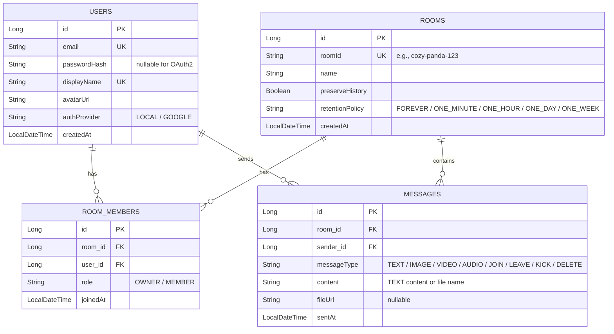

# AetherChat Architecture & Context

AetherChat is a premium real-time chat application with robust user authentication, OAuth2 login, message persistence settings, automated content retention scheduling, file/media attachment support, and active presence tracking.

---

## 🏗️ Technical Stack

### Backend (Spring Boot)
*   **Language & Framework**: Java 17+, Spring Boot 3.x, Maven
*   **Database**: PostgreSQL (for persistent entities: Users, Rooms, Members, Messages)
*   **Cache & Temporary Store**: Redis (specifically for OTP generation, caching, and validation)
*   **Security**: Spring Security (JWT stateless sessions + Google OAuth2 login)
*   **Real-time Protocol**: Spring WebSocket + STOMP messaging broker
*   **Email & Templates**: Thymeleaf (HTML template for email OTP generation) + JavaMailSender

### Frontend (React)
*   **Framework & Language**: React 18, TypeScript, Vite
*   **Routing**: React Router DOM (SPA, protected and public routes)
*   **HTTP Client**: Axios (configured with Request/Response interceptors for JWT auth and automatic 401 logouts)
*   **WebSockets**: `@stomp/stompjs` & `sockjs-client`
*   **Icons**: Lucide React
*   **Styling**: Vanilla CSS (dynamic variables, dark mode aesthetics, glassmorphism)

---

## 🗄️ Database Model (Postgres)



---

## 🔑 Authentication Flows

### Local Registration (with Email OTP)
1.  **Request OTP**: Client POSTs `RegisterRequest` (email, displayName) to `/api/auth/register/request-otp`.
2.  **Generate OTP**: `OtpService` creates a 6-digit numeric OTP, caches it in Redis (`otp:register:<email>`) with a 5-minute expiry, and sends an HTML-styled template using Thymeleaf via Gmail SMTP.
3.  **Verify & Register**: Client POSTs `VerifyOtpRequest` (email, password, displayName, otp) to `/api/auth/register`.
4.  **Database Save**: The backend verifies OTP against Redis. If valid, encrypts the password with `BCrypt`, saves user status under `AuthProvider.LOCAL`, and deletes the OTP from Redis.

### Local Login
1.  Client POSTs credentials (email, password) to `/api/auth/login`.
2.  Backend checks if the user exists, verifies they are not registered with an OAuth2 provider, and matches the BCrypt password hash.
3.  Returns a signed JWT and user response containing identity info.

### Google OAuth2 Sign-In
1.  Client navigates to `/oauth2/authorization/google` (initiated via Spring Security).
2.  On successful auth, `OAuth2SuccessHandler` captures Google user profile details (email, name, picture).
3.  Registers the user in the database under `AuthProvider.GOOGLE` (or updates display info if already registered).
4.  Generates a signed JWT and redirects the client to the frontend callback handler: `/oauth2/redirect?token=<jwt_token>`.

---

## 💬 Real-Time Features & WebSockets

### WebSocket Connection Config
*   **Handshake Endpoint**: `/ws` (supports SockJS fallback)
*   **Inbound Channel Interception**: `WebSocketAuthChannelInterceptor` intercepts connect frames, reads the HTTP `Authorization: Bearer <JWT>` header, validates it, and sets the Security Principal inside the STOMP session.
*   **Destination Prefix**:
    *   Client to Server: `/app`
    *   Server to Client (Broker): `/topic`

### WebSocket Subscriptions & Destinations
*   **Message Channel**: `/topic/room/{roomId}` (receives chat messages and room lifecycle events like JOIN, LEAVE, KICK, DELETE, and PRUNE).
*   **Presence Channel**: `/topic/room/{roomId}/presence` (receives a broadcasted list of active online user emails).
*   **Typing Channel**: `/topic/room/{roomId}/typing` (receives real-time user typing state updates).

### Real-Time User Presence Management
Presence is managed in-memory via `PresenceManager.java`:
*   Uses a thread-safe `ConcurrentHashMap` structure to track active rooms, session connections, and subscribed emails.
*   Listens to Spring events: `SessionSubscribeEvent` (on subscribing to room channel), `SessionUnsubscribeEvent`, and `SessionDisconnectEvent` (on closed tab or disconnect).
*   Checks if the user has other active session maps (e.g. multi-tab/device support) before marking them offline.
*   Triggers presence broadcast list of user emails to `/topic/room/{roomId}/presence`.

---

## 🧹 Automated Message Retention Scheduler

Rooms can be configured with a specific **Retention Policy**:
*   `FOREVER` (No automated cleanup)
*   `ONE_MINUTE` (Used for testing/demo)
*   `ONE_HOUR`
*   `ONE_DAY`
*   `ONE_WEEK`

### Pruning Cycle (`MessageRetentionScheduler`)
1.  **Scheduled Task**: Runs every **10 seconds** (`@Scheduled(fixedRate = 10000)`).
2.  **Expired Lookup**: Queries the Postgres database using a custom join:
    ```sql
    SELECT m FROM Message m JOIN m.room r WHERE r.retentionPolicy = :policy AND m.sentAt < :cutoffTime
    ```
3.  **Disk Attachment Cleanup**: If the message contains a `fileUrl`, it extracts the filename and deletes the physical file stored in `./uploads` to avoid disk leaks.
4.  **Database Deletion**: Deletes expired message entities from the database.
5.  **Real-Time Prune Broadcast**: Broadcasts a system `PRUNE` payload with the pruning cutoff timestamp to `/topic/room/{roomId}`.
6.  **Animated UI Fadeout**: The React client receives the `PRUNE` event, updates local state by marking target messages with an `isPruning` boolean, runs a 500ms CSS slide-and-fade transition (`animate-disappear`), and removes them from memory.

---

## 📂 Media Upload & Attachments
*   **Upload Endpoint**: POST `/api/media/upload` (accepts `MultipartFile` file).
*   **Storage Directory**: Configured via `app.upload.dir` (defaults to `./uploads`).
*   **Avoid Overwrites**: Incoming files are cleaned, combined with a random `UUID`, and stored locally.
*   **Exposed Route**: The backend statically maps `/uploads/**` to `./uploads` on the disk, making files downloadable over HTTP.
*   **Message Type Classification**:
    *   `IMAGE`: Renders a preview box with an overlay image viewer (Lightbox).
    *   `AUDIO`: Renders standard HTML5 `<audio controls>` player.
    *   `VIDEO`: Renders standard HTML5 `<video controls>` player.
    *   `TEXT`: Renders a download link representing other documents.

---

## 📁 Source Directory Map

### Backend
```
backend/src/main/java/com/app/chat/
├── ChatApplication.java                 # Main application configuration & @EnableScheduling
├── auth/
│   ├── AuthController.java              # Local authentication & OTP routing endpoints
│   ├── OtpService.java                  # Generates and caches OTPs in Redis, sends emails
│   └── dto/                             # Authentication DTOs (Register, Login, Response)
├── config/
│   ├── RedisConfig.java                 # Custom Redis configuration supporting URIs/hosts
│   └── WebConfig.java                   # Custom web configurations, exposes uploads directory
├── message/
│   ├── ChatController.java              # STOMP message & typing WebSocket handler
│   ├── MediaController.java             # Multipart/form-data upload controller
│   ├── Message.java                     # Message entity mapped to Postgres
│   ├── MessageRepository.java           # DB repository for querying messages & expired items
│   ├── MessageRetentionScheduler.java   # Runs periodic task to delete expired records & files
│   └── dto/                             # Message payload structures (Message, Typing)
├── room/
│   ├── RetentionPolicy.java             # Enum for retention duration (ONE_MINUTE, FOREVER, etc.)
│   ├── Room.java                        # Room entity with history settings and retention policy
│   ├── RoomController.java              # Room lifecycle (create, join, delete, leave, kick)
│   ├── RoomMember.java                  # Many-to-many link between Room and User with Owner role
│   ├── RoomMemberRepository.java        # Membership queries
│   ├── RoomRepository.java              # Room configuration queries
│   └── dto/                             # Room create requests and responses
├── security/
│   ├── CustomUserDetailsService.java    # Spring security service to load UserPrincipal by email
│   ├── JwtAuthenticationFilter.java     # Request filter for validating JWT headers
│   ├── JwtTokenProvider.java            # Utility to sign and decode JWT tokens
│   ├── OAuth2SuccessHandler.java        # Handlers successful Google authentication
│   ├── SecurityConfig.java              # Main security policy (CORS, CSRF, permitAll paths)
│   └── UserPrincipal.java               # Custom Principal carrying internal user attributes
└── user/
    ├── AuthProvider.java                # Auth enum: LOCAL, GOOGLE
    ├── User.java                        # User entity mapping
    ├── UserController.java              # Profiles management (displayName, avatar change)
    └── UserRepository.java              # User queries (exists, finds)
```

### Frontend
```
frontend/src/
├── App.css                              # Layout positioning stylesheets
├── App.tsx                              # Route definitions (PublicRoute, PrivateRoute)
├── index.css                            # Global theme custom CSS properties & component styling
├── main.tsx                             # React DOM render entry
├── context/
│   └── AuthContext.tsx                  # Local state tracking session user, token & login/logout
├── pages/
│   ├── ChatRoom.tsx                     # Full-fledged real-time workspace UI (messages feed, sidebars)
│   ├── Dashboard.tsx                    # Landing panel (manage user profile, rooms creation, rooms joining)
│   ├── Login.tsx                        # Login form, registration toggle, OTP confirmation
│   └── OAuth2RedirectHandler.tsx        # Captures JWT token from URL params and finishes session login
└── services/
    └── api.ts                           # Axios instance matching base URL and interceptors
```

## 🚀 Environment Variables

Below is the structure of key environment variables supported. Locally, these are defined in a `.env` file; in production hosting (e.g. Render), they are set in the service environment dashboard.

### Local Configuration (`.env`)
```ini
# Local Database Configuration
SPRING_DATASOURCE_URL=jdbc:postgresql://localhost:5432/chatdb
SPRING_DATASOURCE_USERNAME=postgres
SPRING_DATASOURCE_PASSWORD=postgres

# Local Redis Connection Configuration
SPRING_REDIS_HOST=localhost
SPRING_REDIS_PORT=6379

# Google OAuth2 Credentials
GOOGLE_CLIENT_ID=google-client-id-here
GOOGLE_CLIENT_SECRET=google-client-secret-here

# SMTP Mail Credentials (Gmail)
SPRING_MAIL_HOST=smtp.gmail.com
SPRING_MAIL_PORT=587
SPRING_MAIL_USERNAME=your-email@gmail.com
SPRING_MAIL_PASSWORD=your-app-password

# JWT Security
JWT_SECRET=404E635266556A586E3272357538782F413F4428472B4B6250645367566B5970
CORS_ALLOWED_ORIGINS=http://localhost:5173
OAUTH2_REDIRECT_URI=http://localhost:5173/oauth2/redirect
```

### Production Deployment Configuration (Render)
* **`REDIS_URL` or `REDIS_URI`**: Set this to your cloud Redis connection URI (e.g., `rediss://red-xxxxxxxxxx:6379`). The backend automatically parses and prioritizes this string, fallbacking to the local host/port properties if missing.
* **`PORT`**: Automatically injected by Render to bind the web server container port.
* **`SPRING_DATASOURCE_URL` / `SPRING_DATASOURCE_USERNAME` / `SPRING_DATASOURCE_PASSWORD`**: Point to your production PostgreSQL instance.

